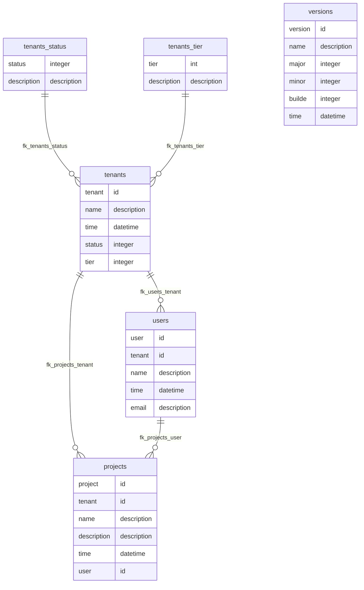

# Entity Relationship Diagram

```mermaid
erDiagram
    tenants_status ||--o{ tenants: fk_tenants_status
    tenants_tier ||--o{ tenants: fk_tenants_tier
    tenants ||--o{ users: fk_users_tenant

    tenants ||--o{ projects: fk_projects_tenant
    users ||--o{ projects: fk_projects_user

    tenants_status {
        status      integer
        description description
    }

    tenants_tier {
        tier        int
        description description
    }

    tenants {
        tenant      id
        name        description
        time        datetime
        status      integer
        tier        integer
    }

    users {
        user        id
        tenant      id
        name        description
        time        datetime
        email       description
    }

    versions {
        version     id
        name        description
        major       integer
        minor       integer
        builde      integer
        time        datetime
    }

    projects {
        project     id
        tenant      id
        name        description
        description description
        time        datetime
        user        id
    }
```