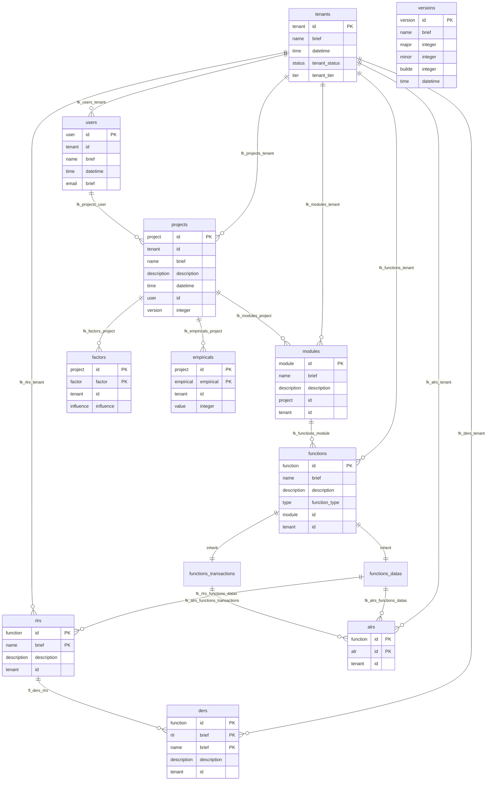

# Entity Relationship Diagram

```mermaid
erDiagram
    functions_datas         ||--o{ rlrs: fk_rlrs_functions_datas

    tenants                 ||--o{ users: fk_users_tenant
    tenants                 ||--o{ projects: fk_projects_tenant
    tenants                 ||--o{ modules: fk_modules_tenant
    tenants                 ||--o{ functions: fk_functions_tenant
    tenants                 ||--o{ rlrs: fk_rlrs_tenant
    tenants                 ||--o{ alrs: fk_alrs_tenant
    tenants                 ||--o{ ders: fk_ders_tenant

    users                   ||--o{ projects: fk_projects_user

    projects                ||--o{ factors: fk_factors_project
    projects                ||--o{ empiricals: fk_empiricals_project
    projects                ||--o{ modules: fk_modules_project

    modules                 ||--o{ functions: fk_functions_module

    functions               ||--|| functions_datas: inherit
    functions               ||--|| functions_transactions: inherit
    functions_datas         ||--o{ alrs: fk_alrs_functions_datas
    rlrs                    ||--o{ ders: fl_ders_rlrs
    %% functions_transactions  ||--o{ ders: fk_ders_functions_transactions
    functions_transactions  ||--o{ alrs: fk_alrs_functions_transactions
        
    tenants {
        tenant      id          PK
        name        brief
        time        datetime
        status      tenant_status
        tier        tenant_tier
    }

    users {
        user        id          PK
        tenant      id
        name        brief
        time        datetime
        email       brief
    }

    versions {
        version     id          PK
        name        brief
        major       integer
        minor       integer
        builde      integer
        time        datetime
    }

    projects {
        project     id          PK
        tenant      id
        name        brief
        description description
        time        datetime
        user        id
        version     integer
    }

    factors {
        project     id          PK
        factor      factor      PK
        tenant      id
        influence   influence
    }

    empiricals {
        project     id          PK
        empirical   empirical   PK
        tenant      id
        value       integer
    }

    modules {
        module      id          PK
        name        brief
        description description
        project     id
        tenant      id
    }

    functions {
        function    id          PK
        name        brief
        description description
        type        function_type
        module      id
        tenant      id
    }

    functions_datas {
    }

    functions_transactions {
    }

    rlrs {
        function    id          PK
        name        brief       PK
        description description
        tenant      id
    }

    ders {
        function    id          PK
        rlr         brief       PK
        name        brief       PK
        description description
        tenant      id
    }

    alrs {
        function    id          PK
        alr         id          PK
        tenant      id
    }    

```
