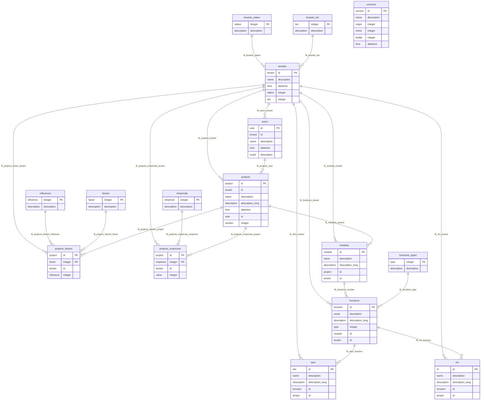

# Entity Relationship Diagram

```mermaid
erDiagram
    tenants_status  ||--o{ tenants: fk_tenants_status
    tenants_tier    ||--o{ tenants: fk_tenants_tier
    tenants         ||--o{ users: fk_users_tenant
    tenants         ||--o{ projects: fk_projects_tenant
    tenants         ||--o{ projects_factors: fk_projects_factor_tenant
    tenants         ||--o{ projects_empiricals: fk_projects_empiricals_tenant
    tenants         ||--o{ modules: fk_modules_tenant
    tenants         ||--o{ functions: fk_functions_tenant
    tenants         ||--o{ ders: fk_ders_tenant
    tenants         ||--o{ rlrs: fk_rlrs_tenant

    users           ||--o{ projects: fk_projects_user

    influences      ||--o{ projects_factors: fk_projects_factors_influence
    factors         ||--o{ projects_factors: fk_projecs_factors_factor
    projects        ||--o{ projects_factors: fk_projects_factors_project

    empiricals      ||--o{ projects_empiricals: fk_projects_empiricals_empirical
    projects        ||--o{ projects_empiricals: fk_projects_empiricals_project

    projects        ||--o{ modules: fk_modules_project
    modules         ||--o{ functions: fk_functions_module
    functions       ||--o{ ders: fk_ders_function 
    functions       ||--o{ rlrs: fk_rlrs_function

    functions_types ||--o{ functions: fk_functions_type
        
    tenants_status {
        status      integer     PK
        description description
    }

    tenants_tier {
        tier        integer     PK
        description description
    }

    tenants {
        tenant      id          PK
        name        description
        time        datetime
        status      integer
        tier        integer
    }

    users {
        user        id          PK
        tenant      id
        name        description
        time        datetime
        email       description
    }

    versions {
        version     id          PK
        name        description
        major       integer
        minor       integer
        builde      integer
        time        datetime
    }

    influences {
        influence   integer     PK
        description description        
    }    

    factors {
        factor      integer     PK
        description description
    }

    empiricals {
        empirical   integer     PK
        description description
    } 

    projects {
        project     id          PK
        tenant      id
        name        description
        description description_long
        time        datetime
        user        id
        version     integer
    }

    projects_factors {
        project     id          PK
        factor      integer     PK
        tenant      id
        influence   integer
    }

    projects_empiricals {
        project     id          PK
        empirical   integer     PK
        tenant      id
        value       integer
    }

    modules {
        module      id          PK
        name        description
        description description_long
        project     id
        tenant      id
    }

    functions_types {
        type        integer     PK
        description description
    }

    functions {
        function    id          PK
        name        description
        description description_long
        type        integer
        module      id
        tenant      id
    }

    ders {
        der         id          PK
        name        description
        description description_long
        function    id
        tenant      id
    }

    rlrs {
        rlr         id          PK
        name        description
        description description_long
        function    id
        tenant      id
    }

```